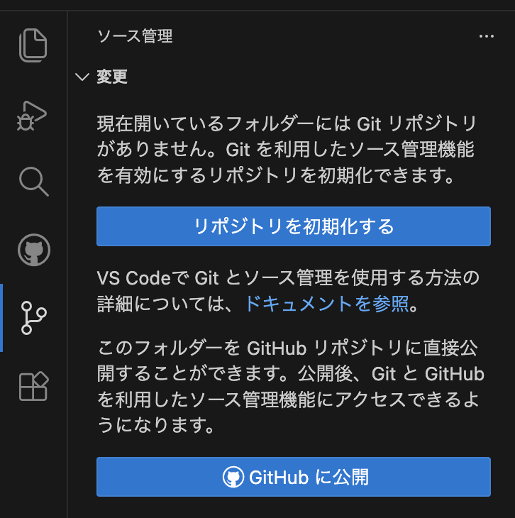

# プログラミング応用

## 課題

芸術専門学群の「プログラミング応用」では、得点の概念を持ったゲームを開発してください。
「プログラミング基礎」で AI を用いた開発環境の構築を行いましたが、今回もその環境を活用して開発を行います。
成果物は以下を全て満たしていることが条件です。

1. 初回授業で配布したテンプレートファイルを用いて開発すること
2. ゲームの結果を得点として表現していること
3. Web ブラウザで動作するアプリケーションであること
4. Javascript を使用し、ES6 に準拠していること
5. ゲームエンジンとして PixiJS 8.0 を用いること
6. ゲームのルートから配置する要素(各画面やゲームキャラクターなど)はクラスとしてファイルを分割してプログラミングすること
7. GitHub でソースコードを管理し、gitflow のルールでコードを修正する過程を全てコミット履歴に残すこと
8. AI に指示した内容を履歴として全て提出すること

---

## 1．開発環境の構築

### 1-1. node.js の確認

node.js は. Javascript をサーバー上で動作させるための仕組みです。
みなさんが使用しているブラウザ上でも Javascript は実行できますが、そこで表示している情報はサーバーから配信されます。
開発を進める際にも、自分のコンピューターがサーバーの役割を果たしてブラウザに情報を表示しています。サーバーとしてのコンピューター上で Javascript を動作させる必要があるため、node.js をインストールしておきましょう。

- node.js が使えるかを確認しよう

  ```console
  node -v
  ```

  バージョン情報が表示されたら OK。
  出ない場合は以下からインストールする
  https://nodejs.org/ja/
  インストール後、再度バージョン情報が表示されるか確認してください。

- npm の確認
  npm は node.js のパッケージ管理ツールです。開発に必要なツールをインストールするために使用します。

  ```console
  npm -v
  ```

  バージョン情報が表示されたら OK。
  出ない場合は node.js のインストールが正しく行われていない可能性があります。再度インストールを行ってください。

### 1-2. Homebrew の確認 (Mac の場合)
開発環境の構築に必要なツールをインストールするために、Homebrew というパッケージ管理ツールを使用します。

- Macに Homebrew がインストールされているか確認しましょう。
  ```console
  brew -v
  ```

  バージョン情報が表示されたら OK。出ない場合は以下からインストールする
  https://brew.sh/ja/
  インストール後、再度バージョン情報が表示されるか確認してください。

### 1-3. おまけ : anyenv

node.js には実はいろんなバージョンがあって、そのうちバージョンの使い分けが必要になります。そういう時には envツールというのを使うのですが、言語ごとにたくさんあるので、よくわかっている人は anyenv という、上位概念のツールを使うとよいでしょう。

以下は Homebrew が入っている場合の、Macでのインストール方法です。

```console
brew install anyenv
```

詳しいことはAIに聞いてください。


## 2. GitHub と Git

### 2-1. git を理解する

「git」はソースコードを管理するための仕組みですが、AI での開発を進めるうえで、いろいろな機能を段階的に開発して管理するためにも、その仕組みを理解しておく必要があります。

GitHub と Git について
https://docs.github.com/ja/get-started/start-your-journey/about-github-and-git

手順を追って、どのように開発するかを見ていきましょう。

### 2-2. コマンドラインから設定を確認しよう

git は主にコマンドラインから使用しますが、VS Code から利用する場合、初期設定をやっておけばその後にコマンドラインを使用しなくても通常の作業は行えます。

- git がインストールされているかの確認
  ```console
   git --version 
  ```

  「git version 2.40.0」みたいなのが出ればOK。

- git のインストール

  - Macの場合

    ```console
    brew install git
    ```

    Windowsの場合は以下のインストーラーでインストールしてください
    https://gitforwindows.org/

- ユーザー名の確認と設定

  ```console
  # ユーザー名を確認する
  git config --global user.name
  
  # ユーザー名を登録する
  git config --global user.name "Your Name"
  ```
- メールアドレスの確認と設定

  ```console
  # メールアドレスを確認する
  git config --global user.email
  
  # メールアドレスを登録する
  git config --global user.email "you@example.com"
  ```

### 2-3. git リポジトリを設定しよう

VS Code から github リポジトリを設定しよう 。
(今回の課題では2-3の設定不要ですが、今後自分のプロジェクトを Github で管理するときにはこの手続きが必要です)

1. まず最初に、プロジェクトフォルダの名前を変更しましょう。
   「project_01」となっているフォルダを任意の名前に変更してください。GitHub 上にこの名前が表示されるので、作りたいゲームの内容を示す名前が望ましいです。
   名前は英数字のみで構成してください。日本語絶対ダメ。
2. メニューから git を選択し、「**GitHub に公開**」を選ぶ
   

### 2-4. git のブランチを活用しよう

ブランチとは、作業中のファイルから分岐して、別の作業を行うための仕組みです。
例えば、みなさんがゲームのキャラクターを追加する作業を行う場合、現在のファイルから分岐して、そのブランチ上でキャラクターの追加作業を行い、完成したら元のファイルに統合することができます。
こうすることで、元のファイルを壊すことなく、新しい機能を追加することができます。


### 2-5. gitflow とは

gitflow は git のブランチ管理方法のひとつで、開発の流れを体系化したものです。
AI を用いた開発を行う際、一人で開発しているというよりも、何人かの作業者がいる状態に近くなりますので、まずはこの方法を身に着けましょう。

git-flow チートシート
https://danielkummer.github.io/git-flow-cheatsheet/index.ja_JP.html

- gitflow を設定しよう

  1. VS Code の拡張機能から「gitflow」と「Gitflow Actions Sidebar」をインストールします。

  2. ターミナルで以下を打って、gitflow をインストールしましょう。
     Mac の場合(Homebrew 設定済を想定)

     ```console
     brew install git-flow
     ```

     Windows の場合は、たぶん最初からインストーラーに gitflow が含まれていると思います。

  3. Gitflow を初期化します。
     プロジェクトのディレクトリ内に移動してターミナルで以下を打つか、VS Code でプロジェクトを開いた状態でAI に「gitflow で初期化して」とお願いする。

     ```console
     git flow init -d
     ```


### 2-7. 実際に開発しながら使ってみよう

AI で開発すると、元のソースコードを大きく改変して、正しい動作が担保できなくなることがあります。
そのためにも、履歴を管理しておくことは非常に重要です。

1. 常にみなさんが開発するブランチは「develop」が基本ですが、新しい機能を追加する場合は「feature/機能名」というブランチを作成して、そのブランチ上で開発を行います。
2. 開発を行う度にコミットしましょう。コミットは自分で行ってもよいですが、AI にコミットしてもらうと履歴に変更内容を書いてくれます。
3. 機能が完成したら、そのブランチを「develop」ブランチに統合します。
4. これらの一連の作業を、GItflow Actions を使って管理します。
